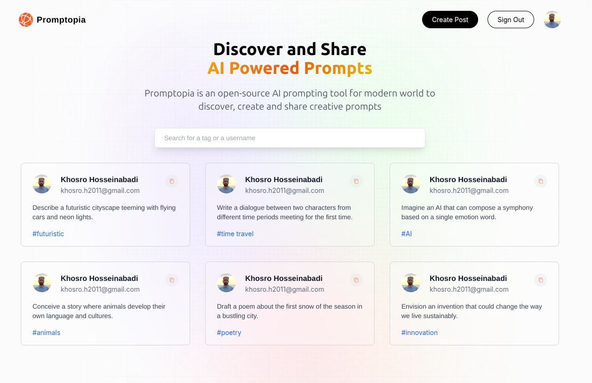
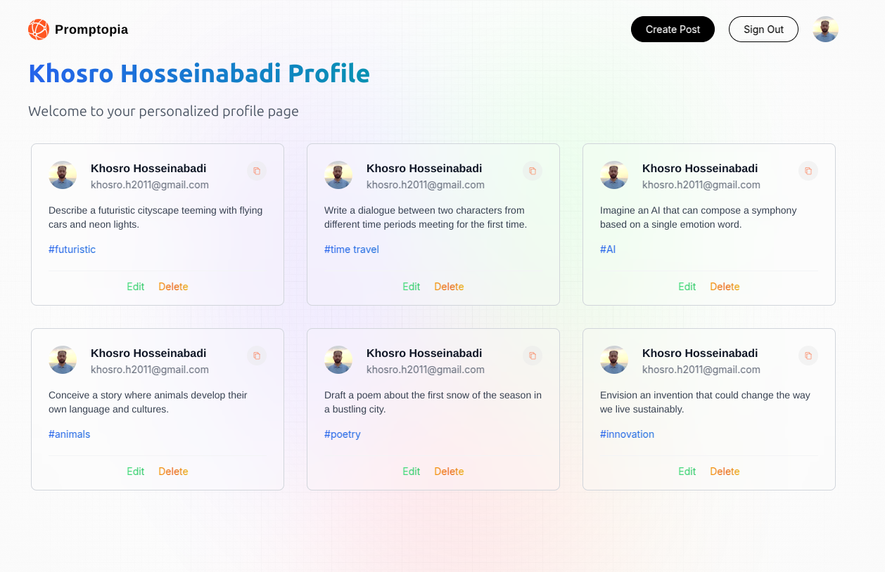
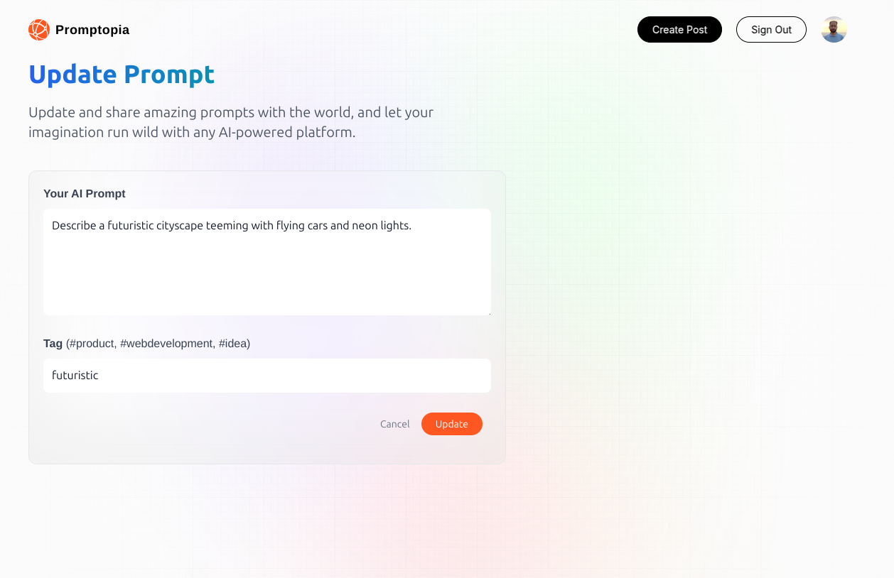

# 🚀 Promptopia

Welcome to **Promptopia**, an open-source platform that allows users to discover, create, and share AI-powered prompts.

## 📖 Project Overview

Promptopia is a `Next.js` application built on top of `React` and `MongoDB`. With user authentication handled by `NextAuth`, users can sign in using Google to create and manage prompts. These prompts can be tagged to improve discoverability.

## ✨ Features

- User Authentication via Google using NextAuth
- Search functionality to filter prompts by keywords
- Create, update, and delete prompts, with ownership restrictions
- User profile management
- Responsive design

## 🛠 Tech Stack

- **Frontend**: Next.js, React, Tailwind
- **Backend**: MongoDB, NextAuth
- **Database**: MongoDB
- **Authentication**: NextAuth with Google Provider

## 🌟 Demo

Check out the live demo of Promptopia at [here]().

## 🚀 Getting Started

### Prerequisites

Ensure you have the following software installed:

- [Node.js](https://nodejs.org/en/) (version 22.x or higher)
- [npm](https://www.npmjs.com/) or [yarn](https://yarnpkg.com/)

### Installation

1. Clone this repository and navigate to the project directory:
   ```bash
   git clone <repository_url>
   cd promptopia
   ```
2. Install dependencies:

   ```bash
   npm install
   ```

   or, using yarn:

   ```bash
   yarn install
   ```

3. Set up the necessary environment variables as outlined in the [Environment Variables](#environment-variables) section.

## 🔑 Environment Variables

To obtain the necessary environment variables, follow these steps:

1. Create a [Google OAuth 2.0 client ID](https://console.cloud.google.com/apis/credentials) and set the authorized redirect URIs to `http://localhost:3000/api/auth/callback/google`.
2. Create a [MongoDB Atlas cluster](https://www.mongodb.com/cloud/atlas) and create a user with read and write permissions.
3. Create a `.env.local` file and add the following variables:

```env
GOOGLE_CLIENT_ID=your_google_client_id
GOOGLE_CLIENT_SECRET=your_google_client_secret
MONGODB_URI=your_mongodb_connection_string
NEXTAUTH_URL=http://localhost:3000
NEXTAUTH_URL_INTERNAL=http://localhost:3000
NEXTAUTH_SECRET=your_nextauth_secret
```

## 🔧 Running the Project

1. To start the development server, run:
   ```bash
   npm run dev
   ```
   or, using yarn:
   ```bash
   yarn dev
   ```
2. Open your browser and navigate to `http://localhost:3000`.

## 📸 Screenshots

### Home Page



### Profile Page



### Update Prompt



## 🤝 Contributing

Contributions and suggestions are welcome! Feel free to open an issue or submit a pull request.

## 📄 License

This project is licensed under the [MIT License](./LICENSE).
